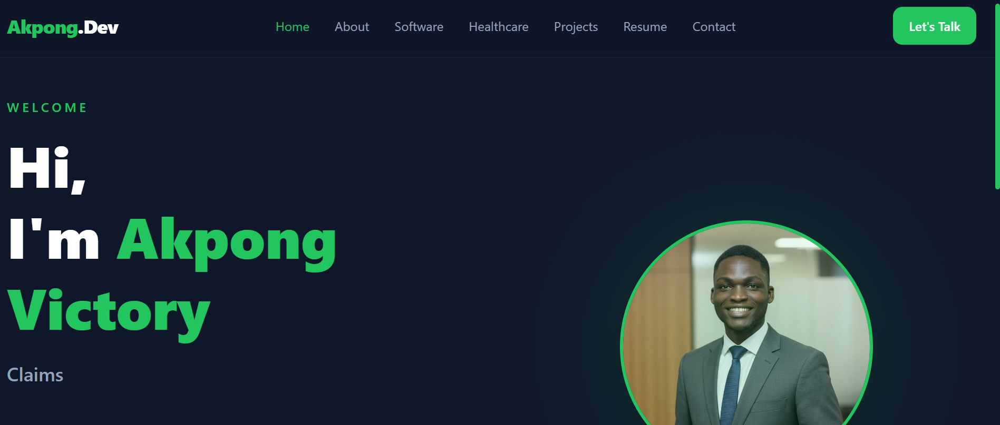

# Akpong Victory Portfolio



A modern, responsive software engineering portfolio showcasing my journey as a Full Stack JavaScript Developer, my technical skills, and the real-world applications I build.

The portfolio combines software engineering, healthcare operations experience, and product-focused development to demonstrate how technology can solve practical business challenges.

---

## 🚀 Live Website

🌐 Portfolio:
https://portfolio-xi-indol-78.vercel.app/

---

## 📌 About The Project

This portfolio was designed and developed to showcase:

- Full-stack development capabilities
- Real-world software projects
- Frontend engineering skills
- Healthcare technology solutions
- Modern UI/UX implementation
- Continuous learning and technical growth

The goal was to create more than a personal website — a professional developer platform that communicates technical ability, problem-solving skills, and product thinking.

---

# ✨ Features

## Modern UI Design

- Responsive design across mobile, tablet, and desktop
- Dark-themed developer-focused interface
- Smooth animations and transitions
- Clean component-based architecture


## Project Showcase

A dynamic project section featuring:

- Featured software projects
- Technology stacks
- Project descriptions
- Live demonstrations
- Engineering challenges and solutions


## Resume Section

Includes:

- Education background
- Professional experience
- Certifications
- Technical competencies


## Software Engineering Profile

Highlights experience with:

- Frontend development
- Backend API development
- Database design
- Healthcare technology solutions
- Responsive application development

---

# 🛠️ Technologies Used

## Frontend

- React
- JavaScript
- Vite
- Tailwind CSS
- Framer Motion
- React Router


## Backend / Data

- Node.js
- Express.js
- PostgreSQL
- Prisma ORM
- Supabase


## Development Tools

- Git
- GitHub
- VS Code
- Vercel Deployment

---

# 📂 Project Structure

```
src
│
├── assets
│
├── components
│   ├── Navbar
│   ├── Footer
│   └── Reusable UI Components
│
├── data
│   ├── projects.js
│   └── skills.js
│
├── pages
│   ├── Home.jsx
│   ├── Resume.jsx
│   ├── Software.jsx
│   ├── Projects.jsx
│   └── Contact.jsx
│
├── App.jsx
└── main.jsx
```

---

# 🚀 Getting Started

## Clone Repository

```bash
git clone https://github.com/yourusername/portfolio.git
```

## Navigate Into Project

```bash
cd portfolio
```

## Install Dependencies

```bash
npm install
```

## Start Development Server

```bash
npm run dev
```

The application will run locally:

```
http://localhost:5173/
```

---

# 📦 Build For Production

Create an optimized production build:

```bash
npm run build
```

Preview production build:

```bash
npm run preview
```

---

# 🧩 Featured Projects

## HopeHill Claims Tracker

A healthcare claims management platform designed to simplify claims processing, reporting, and operational visibility.

Technologies:

- React
- Tailwind CSS
- Supabase
- PostgreSQL
- REST APIs


## Farm2Flame

A technology solution focused on reducing food waste challenges through digital innovation.

Technologies:

- React
- JavaScript
- Tailwind CSS


## Number Ninja

An interactive learning application designed to improve numerical skills through technology.

Technologies:

- React
- JavaScript
- CSS

---

# 🎯 Development Philosophy

I believe good software is built by combining:

- Clean architecture
- User-centered design
- Scalable solutions
- Continuous improvement
- Real-world problem solving

My goal is to build applications that are not only technically sound but also valuable to the people and organizations using them.

---

# 🔮 Future Improvements

Planned improvements include:

- TypeScript migration
- Advanced accessibility improvements
- Additional backend integrations
- More full-stack applications
- Enhanced project case studies

---

# 👨🏽‍💻 Author

**Akpong Victory**

Full Stack JavaScript Developer

Building practical digital solutions with modern web technologies.

---

## Connect With Me

LinkedIn:
(Add your LinkedIn URL)

GitHub:
(Add your GitHub URL)

Portfolio:
(Add portfolio URL)

---

⭐ If you find this project interesting, feel free to explore the code and follow my journey as I continue building software solutions.
